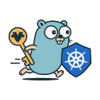

# Kerbernetes (k10s)

[](https://artifacthub.io/packages/search?repo=kerbernetes)




## Description

Kerbernetes is a Kubernetes authentication service that integrates with Kerberos and LDAP for secure access control.

## Features

- Kerberos-based authentication endpoint.
- LDAP integration for user and group management.
- Automatic reconciliation of Kubernetes RoleBindings and ClusterRoleBindings.

## Setup

### Prerequisites

- **k8s** cluster
- **KDC** server
- **LDAP** server (optional, for LDAP group bindings)
- **Helm** for deploying the Kerbernetes chart

### Deployment

Kerbernetes can be deployed using Helm. The Helm chart is available on [Artifact Hub](https://artifacthub.io/packages/helm/kerbernetes/kerbernetes).

```bash
helm repo add froz42 oci://ghcr.io/froz42/kerbernetes
helm install kerbernetes froz42/kerbernetes
```

## Contributing

Contributions are welcome! To contribute:

1. Fork the repository.
2. Create a new branch:

   ```bash
   git checkout -b feature-name
   ```

3. Commit your changes following the conventionnal commit message format:

   ```bash
   git commit -m "feat: add new feature"
   ```

4. Push to your branch:

   ```bash
   git push origin feature-name
   ```

5. Open a pull request.

## License

MIT License

Copyright (c) 2025 froz

Permission is hereby granted, free of charge, to any person obtaining a copy
of this software and associated documentation files (the "Software"), to deal
in the Software without restriction, including without limitation the rights
to use, copy, modify, merge, publish, distribute, sublicense, and/or sell
copies of the Software, and to permit persons to whom the Software is
furnished to do so, subject to the following conditions:

The above copyright notice and this permission notice shall be included in all
copies or substantial portions of the Software.

THE SOFTWARE IS PROVIDED "AS IS", WITHOUT WARRANTY OF ANY KIND, EXPRESS OR
IMPLIED, INCLUDING BUT NOT LIMITED TO THE WARRANTIES OF MERCHANTABILITY,
FITNESS FOR A PARTICULAR PURPOSE AND NONINFRINGEMENT. IN NO EVENT SHALL THE
AUTHORS OR COPYRIGHT HOLDERS BE LIABLE FOR ANY CLAIM, DAMAGES OR OTHER
LIABILITY, WHETHER IN AN ACTION OF CONTRACT, TORT OR OTHERWISE, ARISING FROM,
OUT OF OR IN CONNECTION WITH THE SOFTWARE OR THE USE OR OTHER DEALINGS IN THE
SOFTWARE.
